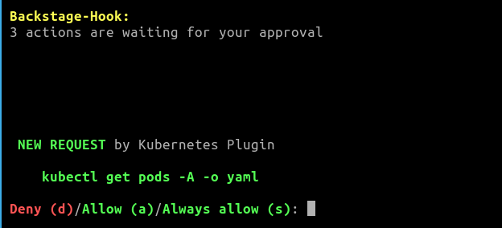

### In development: Not yet functional

# backstage-hook


[](https://codecov.io/gh/tcorp-bv/backstage-hook)



Backstage-hook allows Spotify Backstage plugins to execute commands on your machine. This allows for quick plugin prototyping without compromising security.

## Installation
Installation instructions for [Linux](), [Windows](), [Mac]() and [Docker]().

Installation instructions for [the Backstage plugin]().

## Getting started
To connect with Backstage:
```bash
backstage-hook start http://localhost:3000 
```

Is your Backstage instance running somewhere else? Replace http://localhost:3000 with the correct URI.

## Plugins
**The following plugins use backstage-hook:**
- None yet
